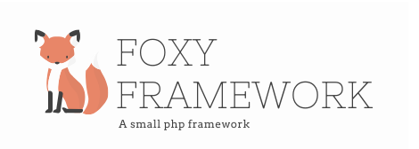

# Foxy Framework
Small PHP Framework made with ♥ from Barcelona

## Installation
Unzip or untar the downloaded file, get the latest version from [github] (https://github.com/foxyframework/foxy).  

Run composer from CLI to download the server-side dependencies.  
`composer install`

Then download the requiered client-side dependencies run bower from CLI.  
`bower install`

## Settings
Before you run your application Foxy needs the database connection parameters from your host.  
Open the configuration file located in classes/config.php.  
Fill the settings at your needs.   
Run the sql file in your database to create the tables structure.